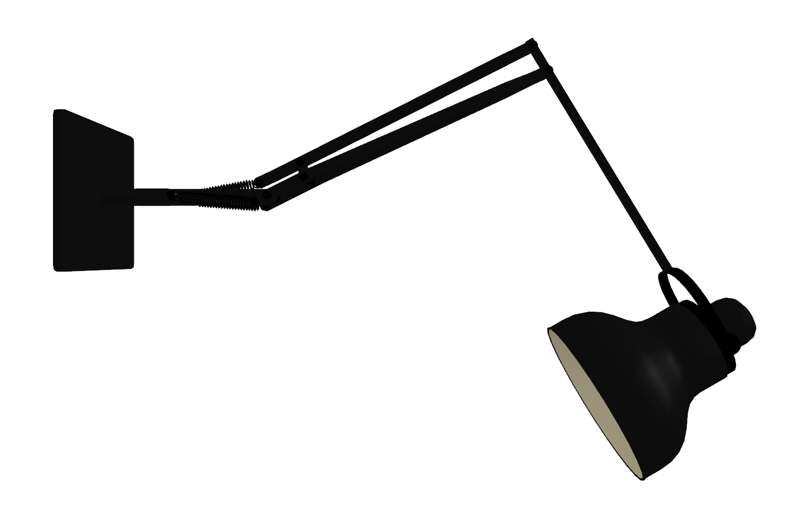
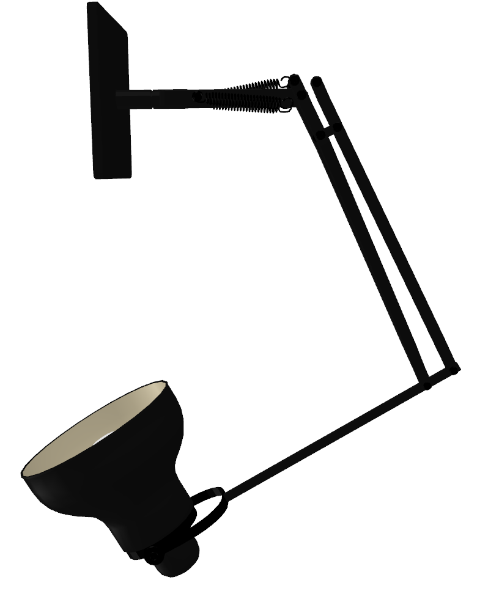
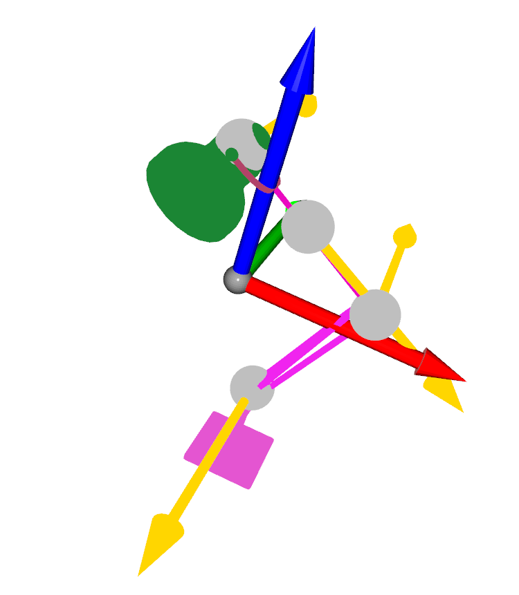

# Helper3D
This repo is used to integrate some useful code snippets for 3D visualization using Open3D and URDF supporter using trimesh (open3d texture support is not good....). 

(For Open3D, please don't use v0.17.0 (see [this](https://github.com/isl-org/Open3D/issues/6009)), which has some issue. v0.15.2 and v0.16.0 is good!)

<table>
  <tr>
    <td></td>
    <td></td>
    <td></td>
    <td></td>
  </tr>
</table>

## TODO
[25.7.14] Rewrite the readme and examples to demonstrate how to use the library

## Latest Update
[23.4.23] Add demo for rendering using pyrender and open3D. Extend lookAt function for different camera configs. Fix some copy potential problem when converting trimesh scene into open3D.

[23.4.1] 
Get joint information in the world coordinate; Fix the lookAt function bug; Support motion update and improve the update function to lazy update to accelerate

[23.3.15?] 
Trimesh URDF -> Support URDF into trimesh.Scene format; Support control the URDF with simple code (see example.py in trimesh_URDF)

## open3d_RGBD
This project is used to visualize the RGBD image in point cloud form using open3D. It involves the transformation from image -> camera coordinate -> world coordinate. 

This part also provide some arrow helper to draw arrows in open3d.

## trimesh_URDF
This project is used to load URDF, visualize and intereact with it using simple code with Trimesh. It inolves a simple scene graph implemetation, a simple (may not contain all attributes) URDF parser and URDF tree constructor. (Check the `demo_RRDF.py` code to see how to play with it).

## trimesh_render
This codebase is just for easy rendering RGB with trimesh (But trimesh rendering is very slow, try to use pyrender)

## pyrender_render
This codebase is just for easy rendering RGB, depth, and all other information with pyrender

## open3d_render
This codebase is just for easy rendering RGB with open3d (depth is also supported, it's easy to get by checking the open3D documentation)